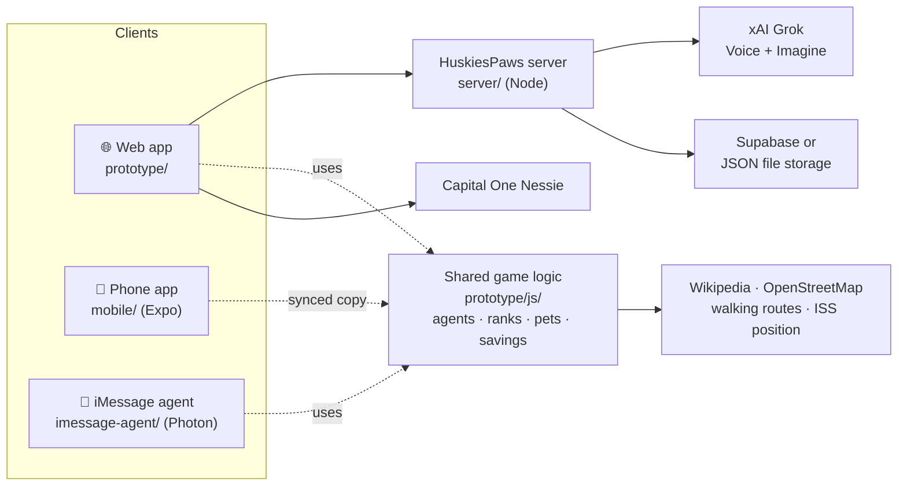

  <picture>
    <source media="(prefers-color-scheme: dark)" srcset="docs/logo/huskiespaws-logo-dark.png">
    
  </picture>

# 🐾 HuskiesPaws

**Walk more, explore more, save more.**

HuskiesPaws turns everyday walking into an adventure. Every walk blooms a flower trail on the map. A squad of AI agents scouts real places for you and walks you there. Walking hatches pets that guard the landmarks you discover. And every rideshare you skip by walking moves the fare into a savings account (through Capital One's Nessie banking sandbox) that grows a tree.

Built at **[BigRed//Hacks 2026](https://bigredhacks2026.devpost.com/)**, Cornell University, October 2–4, 2026. Theme: **Navigation**.

| | |
|---|---|
| 🏆 **Devpost** | _TODO: add the Devpost project link_ |
| 🎬 **Demo video** | _TODO: add the video link (see [docs/DEMO.md](docs/DEMO.md))_ |
| 📊 **Pitch deck (PDF)** | _TODO: add the Google Drive link to the deck PDF_ |
| 🌐 **Live app** | _TODO: add the Render HTTPS link (see [server/README.md](server/README.md#deploy-with-https-render-free))_ |
| 💻 **Code** | https://github.com/LuisMend12/big-red-hacks2026 |

## Team

| Name | Role |
|---|---|
| Luis Mendez | _TODO_ |
| Abdullah Rashid | _TODO_ |

---

## The problem, and why it matters

The hackathon asked: *"What do we build next to change how we navigate in the next 100 years?"*

Today's navigation is built for one thing: **the shortest path.** It puts us in cars and rideshares for trips we could walk, and keeps our eyes on a blue dot instead of the place around us.

- **Short trips add up.** Students take rides for walks of 10–15 minutes, which costs money every week and adds traffic and emissions.
- **We miss what's around us.** Most people walk the same few routes and never discover the landmarks a few blocks away.
- **Healthy habits are hard to keep.** Step counters log numbers but don't give people a reason to walk somewhere new.

## Our solution

HuskiesPaws makes **where you go** the fun part. Navigation becomes about curiosity, not just speed, and it rewards you for walking instead of riding.

| Feature | What it does |
|---|---|
| 🤖 **Agent squad** | **Pip (Scout)** finds real places you've never been, **Moss (Storyteller)** tells their history, and **Fern (Pathfinder)** plans the walking route and guides you. Agents only report facts from real data (Wikipedia and OpenStreetMap), and every postcard links to its source. |
| 🎙️ **Grok Voice and Grok Imagine** | Each agent speaks its memos in its own **Grok Voice**. **Grok Imagine** illustrates every place the agents discover and draws a unique portrait for every pet. |
| 🌸 **Blooming trails** | Your walk leaves a trail of flowers on the map. Each rank unlocks a new trail, from 🌱 Sprout Path to ✨ Starlight. |
| 💰 **Walk instead of ride** | Every walk over 300 m counts as a rideshare you skipped. The estimated fare moves into a savings account through **Capital One's Nessie API**, and your savings grow a tree from 🌰 seed to 🍎 fruit tree. |
| 🥚 **Eggs and pets** | Walking earns eggs, and walking further hatches them into pets with a rarity, from common to legendary. **While the ISS is overhead** (live orbital data), rare pets are 3x as likely. |
| 🏰 **Turf** | Leave your pet to guard a landmark you walked to and earn XP every hour it holds. A player with a stronger pet can take it over, which gives people a reason to keep walking back. |
| 🏆 **Ranks and leaderboards** | Points come from steps, discoveries, captures and turf. Live **local, statewide and national** leaderboards. |
| 📸 **Landmark capture** | At a landmark, open the camera with your agent in the frame and snap a postcard for your album. |
| 💬 **iMessage** | Text the squad: "explore", "story", "take me there". Built with **Photon Spectrum**. |

### Screenshots

_TODO: add 3–4 screenshots to `docs/screenshots/` and link them here: the map with a blooming trail, a Grok Imagine postcard, a pet hatch, and the Savings tree._

## How we built it

- **One set of game rules, three apps.** The agents, ranks, trails, pets, savings and Nessie client are plain JavaScript in [`prototype/js/`](prototype/js/), shared by the web app, the Expo phone app and the iMessage agent.
- **A small server holds every secret.** The Grok key never reaches the browser. The browser can't send its own image prompts; the server builds them from fixed templates. There are per-IP and daily limits, and each image is generated once and cached.
- **Real data only.** Places and facts come from Wikipedia, routes and regions from OpenStreetMap, and the ISS position from wheretheiss.at.

**Built with:** JavaScript, Node.js, HTML/CSS, Mapbox GL JS, Expo / React Native, xAI Grok (Voice, Imagine), Capital One Nessie API, Photon Spectrum, Supabase, Wikipedia API, OpenStreetMap (Nominatim, OSRM), wheretheiss.at, Render, **Cursor**.

### Built with Cursor

_TODO (team): describe how you used Cursor (Agent mode, Tab, rules files), with a few example prompts and what they built. Link `CURSOR_LOG.md` and screenshots if you have them, and mention Grok Bot if you used it for planning. Keep it accurate: judges may ask._

## Prize tracks

| Track | How HuskiesPaws meets it |
|---|---|
| **BigRed Track** (technical, design, creativity, impact, theme) | Navigation by curiosity instead of shortest path. Three working apps sharing one codebase, real data, and an automated test suite. |
| **SpaceX: Make it Legendary** | **Grok Voice** (agent memos) and **Grok Imagine** (postcards and pet portraits) are core features. **Real space data:** live ISS position and visibility footprint decide when rare eggs hatch. Built with **Cursor** (see above). |
| **Capital One: Best Use of Nessie** | Each walk that replaces a ride moves the estimated fare from checking into savings with a Nessie **transfer**. The account is set up with Nessie customer and account endpoints. Savings grow a visible tree, and eggs are never bought with that money. |
| **Photon: Agents in iMessage** | The agent squad runs on iMessage through **Photon Spectrum**: explore, stories, walking directions and savings by text. |
| **Software** | A backend with validation, rate limits, caching and storage that's swappable between Supabase and a file. 24 automated tests plus browser end-to-end tests. |
| **Design** | A cohesive, cozy visual language: blooming trails, illustrated postcards, rarity reveals and an accessible tab layout. |
| **People's Choice** | Turf turns other hackers into players: claim landmarks around PSB and Klarman and defend them. |

## Devpost answers (drafts)

**Inspiration.** Walking games like Pikmin Bloom and Pokémon GO get people outside. We wanted that joy, plus agents that do real work for you and a tangible reward, visible savings, for choosing to walk instead of ride. The Navigation theme pushed us to ask what "getting somewhere" could mean beyond the shortest route.

**What it does.** See [Our solution](#our-solution): agents scout real places and guide you there, your walk blooms on the map, skipped rides become real savings through Nessie, walking hatches Grok-drawn pets that guard landmarks, and everything works on the web, on your phone and over iMessage.

**How we built it.** See [How we built it](#how-we-built-it): shared JavaScript game logic, a Node server that keeps the Grok key private, an Expo phone app, and a Photon Spectrum iMessage agent.

**Challenges we ran into.**
- **The Nessie API kept resetting connections** while we built, so savings are kept in a local ledger first and mirrored to Nessie when it responds. The demo never breaks.
- **Wikipedia and OpenStreetMap returned 403** to the phone app's default identity, so we added an identifying User-Agent for the phone and the iMessage agent, while browsers stay on CORS-safe defaults.
- **Keeping an AI key safe in a public web app:** server-side prompt templates, validation, rate limits and image caching.
- **Judging is indoors,** so we built a demo mode that simulates walks along real walking routes.
- **There's no public Uber pricing API,** so fares are a clearly labeled estimate.

**Accomplishments that we're proud of.** Three working clients that share one set of game rules. Agents that only say what real data supports. Grok features that fall back gracefully without a key. Rare eggs tied to the real ISS overhead.

**What we learned.** Designing APIs so secrets stay on the server, building one codebase for web, phone and chat, and how much a small reward changes whether people choose to walk.

**What's next.**
- Pets, turf and Grok in the phone app.
- Real AR capture (ARKit / ARCore) and background walk tracking.
- Accessibility: tagging stairs, ramps and broken elevators.
- Friends and shared campus gardens.
- Real accounts, and server-side checks against fake steps.

## Run it

| Version | Run it | Guide |
|---|---|---|
| 🌐 **Web app + server** (Grok, leaderboards, turf) | `cd server` then `npm start`, and open http://localhost:8765 | [server/README.md](server/README.md) |
| 🌐 Web app only (no server features) | `cd prototype` then `python serve.py` | [prototype/README.md](prototype/README.md) |
| 📱 **Phone app** | `cd mobile`, `npm install`, `npx expo start`, then scan with Expo Go | [mobile/README.md](mobile/README.md) |
| 💬 **iMessage agent** | `cd imessage-agent`, `npm install`, `npm run terminal` (no keys) or `npm start` | [imessage-agent/README.md](imessage-agent/README.md) |

Keys go in a root `.env` file, which git ignores. See [server/.env.example](server/.env.example) and [imessage-agent/.env.example](imessage-agent/.env.example). The app runs without keys, using fallbacks.

**Tests:** `npm test` in `prototype/` (game logic), `server/` (API, using a fake Grok service) and `imessage-agent/` (full conversation).

## Submission checklist (due Sunday 8:30 AM on Devpost)

- [ ] **GitHub link** to this repo on Devpost, with the repo **public**
- [ ] **Pitch deck** as a **Google Drive link to a PDF**: name and team, problem and why it matters, solution and screenshots, tech stack, impact and future potential (this README has all of it)
- [ ] Devpost questions answered (drafts above) and **tracks selected**: BigRed, SpaceX, Capital One, Photon, Software, Design, People's Choice
- [ ] Demo video linked
- [ ] Live HTTPS app deployed, with `XAI_API_KEY` set and `/api/health` showing `"grok":true`
- [ ] TODOs in this README filled in: team, links, screenshots, Cursor section
- [ ] At least 5 minutes set aside to submit; late submissions aren't accepted
- [ ] Ready for judging: 9:00 AM, 4 minutes per table (2-minute pitch, 2-minute Q&A). Script: [docs/DEMO.md](docs/DEMO.md)

## Repository

| Path | What's there |
|---|---|
| [`server/`](server/) | Backend: serves the web app, plus Grok, leaderboards and turf APIs |
| [`prototype/`](prototype/) | Web app and the shared game logic (`js/`) |
| [`mobile/`](mobile/) | Expo phone app |
| [`imessage-agent/`](imessage-agent/) | Photon Spectrum iMessage agent |
| [`docs/`](docs/) | [Demo plan](docs/DEMO.md), [mobile plan](docs/mobile-migration.md), [hackathon info](docs/general-info.pdf), [brainstorming archive](docs/brainstorm.md), idea sheets |
| [PLAN.md](PLAN.md) | Scope and priorities for the weekend |
| [AGENTS.md](AGENTS.md) | Notes for AI coding agents (Cursor, Claude Code) |
