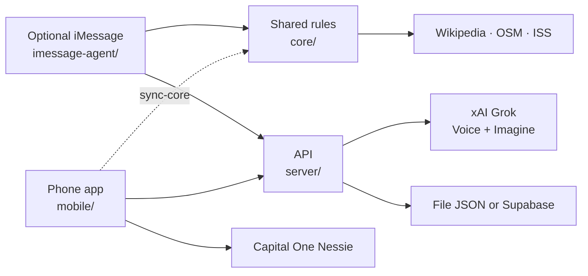

<p align="center">
  <picture>
    <source media="(prefers-color-scheme: dark)" srcset="docs/logo/huskiespaws-logo-dark.svg">
    
  </picture>
</p>

# HuskiesPaws

**Walk somewhere new. Bloom a trail. Hatch a pet. Skip the ride.**

HuskiesPaws is a location-based walking game for phones. It was built at [BigRed//Hacks 2026](https://bigredhacks2026.devpost.com/) at Cornell University (October 2–4, 2026) around the theme **Navigation**.

Code: [github.com/LuisMend12/big-red-hacks2026](https://github.com/LuisMend12/big-red-hacks2026)

| | |
|---|---|
| **Team** | Luis Mendez, Abdullah Rashid |
| **Product** | The Expo phone app in [`mobile/`](mobile/) |
| **Theme** | Navigation as curiosity and walking, not only the shortest car route |

The app was called **Wanderlings** while we brainstormed. Saved progress still uses the `wanderlings:` storage prefix on purpose. Renaming those keys would wipe walks, pets, and albums already on a device.

---

## Description

Everyday navigation tools optimize for **the shortest path**. They put people in cars and rideshares for trips they could walk, and they keep eyes on a blue dot instead of the place around them.

HuskiesPaws is for students and anyone who walks a campus or neighborhood and wants a reason to go somewhere new. The phone app:

- Scouts **real nearby places** with a squad of agents (Pip, Moss, and Fern)
- Blooms a **flower trail** as you walk
- Treats walks over 300 m as a rideshare you skipped, and grows a **savings tree**
- Hatches **pets** from walking (never from bank money) that can **guard landmarks**
- Uses **Wikipedia, OpenStreetMap, walking routes, and live ISS position** for facts and rarity — agents do not invent place history

The product is the **phone app**. There is no web frontend in this repository. A Node API in [`server/`](server/) holds secrets (Grok, optional Supabase). An optional [`imessage-agent/`](imessage-agent/) runs the same squad over Photon Spectrum. Pip can text **today’s step count and places you passed** when the phone (or an iMessage walk) updates the shared day log.

Shared rules live in [`core/`](core/) (plain JavaScript, no DOM or React Native). That folder is the source of truth. [`mobile/src/core/`](mobile/src/core/) is a **generated copy**. Edit `core/`, then run `npm run sync-core` in `mobile/`. Never edit `mobile/src/core/` by hand.



---

## Features

### In the phone app

| Feature | What you get |
|---|---|
| **Squad** | **Pip (Scout)** finds a nearby place you have not visited. **Moss (Storyteller)** reads Wikipedia-backed history. **Fern (Pathfinder)** plans a walking route. Memos are filled from tools, not free-form LLM place facts. |
| **Blooming trails** | Walks drop flowers on the map. Rank unlocks trail styles. |
| **Demo vs live walk** | Demo mode (on by default) simulates the walk along a real route for indoor judging. Turn it off to use GPS; Fern notices when you are close. Live location can also use the phone step counter. Today’s steps and places are posted to the API for Pip. |
| **Capture + album** | Within about 50 m of a landmark, open the camera with an agent in frame and save a postcard. |
| **Eggs and pets** | Walking earns eggs; walking farther hatches them (common → legendary). Eggs are **never** bought with Nessie savings. Starter pets are Pip, Moss, and Fern. |
| **ISS rarity** | While the ISS is overhead ([wheretheiss.at](https://wheretheiss.at)), rarer hatches are 3× as likely and the pet is marked space-born. |
| **Turf** | Claim a landmark with a pet (cap of 3). Stronger pets can take over. Holding earns XP; HP decays unless you visit. Offline, the map can show **sample** rivals until the API answers. |
| **Ranks** | Points from walking and play. Leaderboards are **sample data** unless `EXPO_PUBLIC_API_URL` points at a running server. |
| **Savings tree** | Walks ≥ 300 m estimate a skipped rideshare fare (labeled estimate; there is no public Uber price API) and grow a tree. Optional Nessie transfer when a sandbox key is entered in the app. |
| **Maps** | Expo Go: Apple Maps on iOS, Google Maps on Android (`react-native-maps`). **Garden map:** MapLibre + OpenFreeMap Liberty, **iOS development builds only**. |

### Server-backed (optional)

The phone still runs without the server: on-device speech (`expo-speech`), SVG / local pet art, sample leaderboards, turf off or sample.

When `EXPO_PUBLIC_API_URL` is set and [`server/`](server/) is running:

- **Grok Imagine** can draw **pet portraits** after a hatch (`POST /api/imagine`, `kind: "pet"`). Postcard Imagine exists on the server; the phone does not currently request postcard images.
- **Grok Voice** is implemented as `POST /api/voice` on the server. The phone app still speaks with **expo-speech**; it does not call `/api/voice` yet.
- Live **leaderboards** and **turf** go through `/api/score`, `/api/leaderboard`, `/api/turf`.
- **Today’s walk** (`POST` / `GET /api/day`) stores step count and places passed for the local calendar day. The phone pushes it; Pip reads it over iMessage.

Grok calls are tested against a **fake** xAI service in `server/` tests. They have **not** been verified against live xAI in this repo’s documented test suite. Set `XAI_API_KEY` to try them.

### iMessage (optional Photon track)

Terminal mode works with no keys. Live iMessage needs Photon project credentials. Chat sessions are **in memory** (restart forgets location and savings). On Photon’s **Free** plan, register your iPhone as a project user, then text the **assigned** shared number. The agent may not be allowed to **start** a chat until you message first (`Target not allowed for this project`).

**Daily walk updates.** Pip texts places you actually passed and today’s steps:

- On iMessage, **`today`** or **`steps`** asks for the tally. **`arrived`** logs that stop and estimated steps from the route, then sends the tally.
- Unprompted: when the phone (or an iMessage arrive) records a **new place** or a **step milestone** (1,000 / 2,500 / 5,000 / 10,000…), Pip texts the same kind of update. Small step bumps stay quiet.
- Facts stay grounded: place titles come from the map / day log, not an LLM.

To link the phone to Pip, set the **same E.164 number** as `EXPO_PUBLIC_PHOTON_PHONE` on the phone and `DEMO_PHONE_NUMBER` on the agent, plus `EXPO_PUBLIC_API_URL` and `HUSKIESPAWS_API_URL` pointing at the running API. The agent polls `/api/day` about every 45 seconds.

### Not done / known limits

From [PLAN.md](PLAN.md) and the current code:

- **Not deployed.** [`render.yaml`](render.yaml) is ready; no live HTTPS URL is documented. Create a Render service if you need phones off your laptop to hit the API.
- **Supabase storage is written but untested** against a live project. Default storage is `server/data/db.json`.
- **Nessie HTTP calls are untested** (the API was resetting connections). Store builds may block plain HTTP to Nessie; Expo Go allows it.
- Android / Google Maps still has rough edges. Garden 3D map needs an **iOS development build**; Expo Go stays on Apple Maps.
- No true AR, no background tracking, no Grok chat personality layer.
- The former web prototype was **removed**. Do not add a web app.

---

## Installation

### Prerequisites

| Tool | Version | Used for |
|---|---|---|
| [Node.js](https://nodejs.org/) | **22.9 or newer** (`server/` and `imessage-agent/` engines) | API, tests, Expo, Photon agent |
| [Git](https://git-scm.com/) | any | Clone |
| **Expo Go** | SDK **57** | Phone app without a native binary |
| Xcode (Mac) or [EAS](https://docs.expo.dev/eas/) | — | iOS **garden map** development build only |

```bash
node --version   # should be v22.9 or higher
git --version
```

[`core/`](core/) and [`server/`](server/) have **no npm dependencies**. [`mobile/`](mobile/) and [`imessage-agent/`](imessage-agent/) need `npm install`.

### Clone

```bash
git clone https://github.com/LuisMend12/big-red-hacks2026.git
cd big-red-hacks2026
```

Paths with spaces must be quoted in the shell.

### Environment files

Keys are **optional** unless you want that integration. Never commit `.env`. Never put Grok, Photon, Nessie, or Supabase secrets in the Expo bundle.

**Repo root `.env`** (also read by `server/` via `--env-file-if-exists=../.env`). Template: [`server/.env.example`](server/.env.example).

```ini
# xAI Grok Voice + Imagine (console.x.ai → API Keys). Leave empty to keep Grok off.
XAI_API_KEY=
# Optional: keeps leaderboards and turf across restarts (Supabase -> Project Settings -> API)
SUPABASE_URL=
SUPABASE_SERVICE_KEY=

# PORT=8765
```

**Phone app** [`mobile/.env.example`](mobile/.env.example) → `mobile/.env`:

```ini
# Public HTTPS (or LAN) URL of the API. No secrets.
EXPO_PUBLIC_API_URL=
# Same E.164 number Photon texts, so Pip can report today's walk. Not a secret.
EXPO_PUBLIC_PHOTON_PHONE=
```

Example local value: `EXPO_PUBLIC_API_URL=http://127.0.0.1:8765` (a physical phone usually cannot reach that; use a tunnel or Render).

**iMessage agent** [`imessage-agent/.env.example`](imessage-agent/.env.example) → `imessage-agent/.env`:

```ini
SPECTRUM_PROJECT_ID=your-project-id
SPECTRUM_PROJECT_SECRET=your-project-secret
DEMO_PHONE_NUMBER=
HUSKIESPAWS_API_URL=
```

Get id and secret from [app.photon.codes](https://app.photon.codes/) → project → Settings. Hackathon promo mentioned in the agent README: `HACKWITHPHOTON`. `DEMO_PHONE_NUMBER` is optional (E.164). Set `HUSKIESPAWS_API_URL` to the same origin as `EXPO_PUBLIC_API_URL` so Pip can poll today’s steps and places. On Free, outbound welcome texts and unprompted tallies can fail until you iMessage the assigned Photon number first.

### Dependencies

```bash
cd mobile
npm install
```

```bash
cd imessage-agent
npm install
```

`core/` and `server/`: nothing to install.

---

## Usage

Run commands **inside the package folder** (or `cd` there first).

### Backend API

```bash
cd server
npm start
```

Open [http://localhost:8765/api/health](http://localhost:8765/api/health). JSON envelope:

```json
{ "success": true, "data": { "grok": false, "storage": "file" }, "error": null }
```

`grok` is `true` when `XAI_API_KEY` is set. `storage` is `file` or `supabase`. Startup logs look like `Grok: on · storage: file`. Stop with `Ctrl+C`.

The server **does not serve web pages** (`GET /` is 404). It serves `/api/*` and generated `/images/*`.

Deploy (optional): push the repo, in [Render](https://render.com) use **New → Blueprint** ([`render.yaml`](render.yaml)), set `XAI_API_KEY`, then put the `https://…onrender.com` origin in `EXPO_PUBLIC_API_URL`. Free Render sleeps after idle time; disk resets on deploy unless you use Supabase. Details: [`server/README.md`](server/README.md).

### Phone app — Expo Go

On venue or guest Wi-Fi, use the Cloudflare tunnel (avoids Expo’s shared ngrok quota):

```bash
cd mobile
npm run tunnel
```

Wait for **Tunnel ready**, then scan the QR code (iPhone Camera, or Expo Go on Android). Allow location, camera, and motion.

On a trusted LAN where the phone can reach the laptop:

```bash
cd mobile
npm run start:go
```

`npm start` / `expo start` prefers a development client once `expo-dev-client` is installed; `start:go` and `npm run tunnel` target Expo Go.

### Phone app — iOS garden map (development build)

The tilted **garden** map (MapLibre Native, OpenFreeMap Liberty, extruded buildings) is **not in Expo Go**. Import happens only after `canUseNativeMapLibre()` (iOS and not Expo Go).

On a Mac:

```bash
cd mobile
npm install
npx expo run:ios
```

(`npm run ios:dev` is the same script.) This compiles a **HuskiesPaws** dev client. Later: `npx expo start` and open that client, not Expo Go. In the app, **🌿 Garden** / **🗺️ Map** switches renderers (saved as `wanderlings:mapRenderer`).

Windows cannot compile iOS locally. Use EAS:

```bash
cd mobile
npx eas-cli@latest login
npx eas-cli@latest build --platform ios --profile development
```

Install the build, then `npx expo start --dev-client` (or `npm run tunnel -- --dev-client` on guest Wi-Fi).

Attribution for garden tiles: OpenFreeMap, OpenMapTiles, OpenStreetMap. No map API key.

Android stays on `react-native-maps` / Google Maps.

### iMessage agent (optional)

No Photon keys:

```bash
cd imessage-agent
npm run terminal
```

Live iMessage (after `.env` is filled and a Free/Pro user or Business line is configured in Photon):

```bash
cd imessage-agent
npm start
```

You should see `HuskiesPaws agent listening on iMessage…`. Photon Cloud does **not** require a Mac. Keep the API running if you want Pip to text daily steps and places from the phone app. Guide: [`imessage-agent/README.md`](imessage-agent/README.md).

### Tests and checks

```bash
cd core && npm test
cd ../server && npm test
cd ../imessage-agent && npm test
cd ../mobile && npx expo lint
```

Optional before shipping phone changes: `npx expo-doctor` and `npx expo export --platform android --platform ios` in `mobile/` (writes gitignored `dist/`).

iMessage conversation tests hit live Wikipedia / OSM (need network). Server tests use a fake xAI. They do not prove a live Grok or Nessie account.

### Quick fixes

| Problem | What to try |
|---|---|
| PowerShell blocks `npm` / `npx` | Use Command Prompt, or `Set-ExecutionPolicy -Scope CurrentUser RemoteSigned` once |
| Port 8765 in use | Stop the other process, or `$env:PORT=8800; npm start` in `server/` |
| Expo spins forever | `npm run tunnel` |
| Health `"grok": false` | Set `XAI_API_KEY` in root or `server/.env` and restart |
| Wikipedia / OSM 403 | Clients must send `User-Agent: HuskiesPaws/1.0 (...)` via `core/services.js` `setRequestHeaders` |

---

## Examples

### Indoor demo (Expo Go)

1. `npm start` in `server/` (optional).
2. `npm run tunnel` in `mobile/`, open in Expo Go.
3. **Squad → Explore.** Pip returns a nearby place and a spoken memo (on-device speech).
4. **Take me there** with **demo mode on.** The trail blooms along a real walking route.
5. **📸 Capture** → save to **Album**.
6. **Pets:** walk until an egg hatches. **Ranks** and **Savings** show points and the tree.

### Outdoor walk

Turn **demo mode off** and enable live location. Walk the route; arrival is based on GPS (about 40 m). Real steps can count toward rank while the app is open, and today’s count plus places you passed are posted to `/api/day` for Pip. Android step counting does not continue in the background in this build.

### iMessage (terminal)

```text
hi
I'm at Klarman Hall
explore
story
take me there
arrived
today
savings
```

Same commands work on iMessage after you text the Photon assigned number from a registered user phone. After `arrived` (or when the phone logs a new place / step milestone), Pip answers with today’s steps and the places you passed.

### API (verified against `server/test/api.test.js`)

JSON responses use `{ "success", "data", "error" }` except raw TTS audio.

Health:

```bash
curl -s http://localhost:8765/api/health
```

Grok Voice (needs `XAI_API_KEY`; voices `eve`, `ara`, `rex`; max 600 characters):

```bash
curl -s -X POST http://localhost:8765/api/voice \
  -H "Content-Type: application/json" \
  -d "{\"text\":\"Hi from Pip!\",\"voice\":\"ara\"}" \
  --output pip.mp3
```

Imagine a postcard (server builds the prompt; the client cannot send a free-form image prompt):

```bash
curl -s -X POST http://localhost:8765/api/imagine \
  -H "Content-Type: application/json" \
  -d "{\"kind\":\"postcard\",\"placeId\":\"12345\",\"title\":\"Bailey Hall\",\"fact\":\"The largest auditorium at Cornell.\"}"
```

Pet portrait (`kind` `pet`; `rarity` one of `common|rare|epic|legendary`; `petClass` one of `Scout|Storyteller|Pathfinder|Guardian`; `color` must be a name from `core/pets.js` `PET_COLORS`, e.g. `mint`):

```bash
curl -s -X POST http://localhost:8765/api/imagine \
  -H "Content-Type: application/json" \
  -d "{\"kind\":\"pet\",\"petId\":\"pet-123456\",\"rarity\":\"rare\",\"petClass\":\"Scout\",\"color\":\"mint\"}"
```

Leaderboard (player ids are not returned):

```bash
curl -s -X POST http://localhost:8765/api/score \
  -H "Content-Type: application/json" \
  -d "{\"playerId\":\"player-aaaaaa\",\"name\":\"Ana\",\"score\":1200,\"region\":{\"local\":\"Ithaca\",\"state\":\"New York\",\"national\":\"United States\"}}"

curl -s "http://localhost:8765/api/leaderboard?scope=state&region=New%20York&me=player-aaaaaa"
```

Turf: `GET /api/turf?me=<playerId>`, `POST /api/turf/claim` with player, landmark, and pet fields (see [`server/src/validate.js`](server/src/validate.js)).

Today’s walk (needs `playerId` and/or E.164 `phone`; the server keeps the **max** step count and **unions** places for the local calendar day):

```bash
curl -s -X POST http://localhost:8765/api/day \
  -H "Content-Type: application/json" \
  -d "{\"phone\":\"+16075551234\",\"steps\":2100,\"places\":[{\"id\":\"sage\",\"title\":\"Sage Chapel\"}]}"

curl -s "http://localhost:8765/api/day?phone=%2B16075551234"
```

---

## Contributing

Work happened in **Cursor** for the SpaceX track. Keep [`.cursor/rules/`](.cursor/rules/) current and log substantial prompts in [`CURSOR_LOG.md`](CURSOR_LOG.md). Scope and weekend priorities: [`PLAN.md`](PLAN.md). Agent notes: [`AGENTS.md`](AGENTS.md). Ownership split: [`SPLIT.md`](SPLIT.md).

### Layout

| Path | Role |
|---|---|
| [`core/`](core/) | Game rules: agents, rank, leaderboard, savings, Nessie client, pets, geo, art, config, day log, Wikipedia/OSM/ISS helpers |
| [`mobile/`](mobile/) | Expo SDK 57 app |
| [`mobile/src/core/`](mobile/src/core/) | **Generated** from `core/` |
| [`mobile/src/map/`](mobile/src/map/) | iOS MapLibre garden map |
| [`server/`](server/) | `/api` only; secrets stay here |
| [`imessage-agent/`](imessage-agent/) | Photon Spectrum or terminal |
| [`docs/`](docs/) | Idea sheets, demo notes, [logo](docs/logo/README.md), [mobile plan](docs/mobile-migration.md) |

### Shared logic workflow

1. Change files only under `core/` (not `mobile/src/core/`).
2. Keep core free of DOM and React Native.
3. `cd core && npm test`
4. `cd mobile && npm run sync-core` (copies the core modules, including `dayLog.js`, and prepends a generated header).
5. `npx expo lint` in `mobile/`.
6. If the iMessage bot depends on the change, `npm test` in `imessage-agent/`.
7. Commit `core/` **and** the updated `mobile/src/core/` together.

### Code conventions

- Immutable updates in `mobile/src/game/` (spread, `map`, `filter`).
- Keep files around 400 lines.
- `mobile/src/api.js` returns `null` on failure so UI can fall back.
- Identifying `User-Agent` for Wikipedia and OSM.
- Eggs from walking only.

### Verification by area

| You changed | Run |
|---|---|
| `core/` | `npm test` in `core/`, then `npm run sync-core` and `npx expo lint` in `mobile/` |
| `server/` | `npm test` in `server/` |
| `mobile/` | `npx expo lint` (and export if you touch native/config) |
| `imessage-agent/` | `npm test` in `imessage-agent/` |

Do not commit `.env` files. `git status` must not list them.

---

## Prize tracks (intent)

| Track | How this repo aims at it |
|---|---|
| **BigRed** | Navigation by exploration and walking, not only shortest path |
| **SpaceX** | Grok Voice/Imagine on the server; ISS-linked rarity; built with Cursor |
| **Capital One Nessie** | Skipped-ride transfers into savings; eggs not purchased with that money |
| **Photon** | Squad over iMessage via Spectrum, including Pip’s daily places-and-steps updates |
| **Software / Design / People’s Choice** | Shared `core/`, tests, turf as a reason to walk back to campus landmarks |

---

## License

This repository **does not specify a project license** (no root `LICENSE`). [`mobile/LICENSE`](mobile/LICENSE) is the MIT license that ships with Expo’s template and covers that Expo copyright, not a license grant for HuskiesPaws as a whole.

Place data: Wikipedia and OpenStreetMap contributors. Garden map: OpenFreeMap, OpenMapTiles, OpenStreetMap. ISS: wheretheiss.at. Logo notes: [`docs/logo/README.md`](docs/logo/README.md).

---

## More docs

| Doc | Contents |
|---|---|
| [`mobile/README.md`](mobile/README.md) | Expo Go, tunnel, garden map, troubleshooting |
| [`server/README.md`](server/README.md) | API, Render, Supabase, rate limits |
| [`imessage-agent/README.md`](imessage-agent/README.md) | Photon setup and text commands |
| [`docs/DEMO.md`](docs/DEMO.md) | Indoor demo path (no video required) |
| [`AGENTS.md`](AGENTS.md) | Constraints for coding agents |
