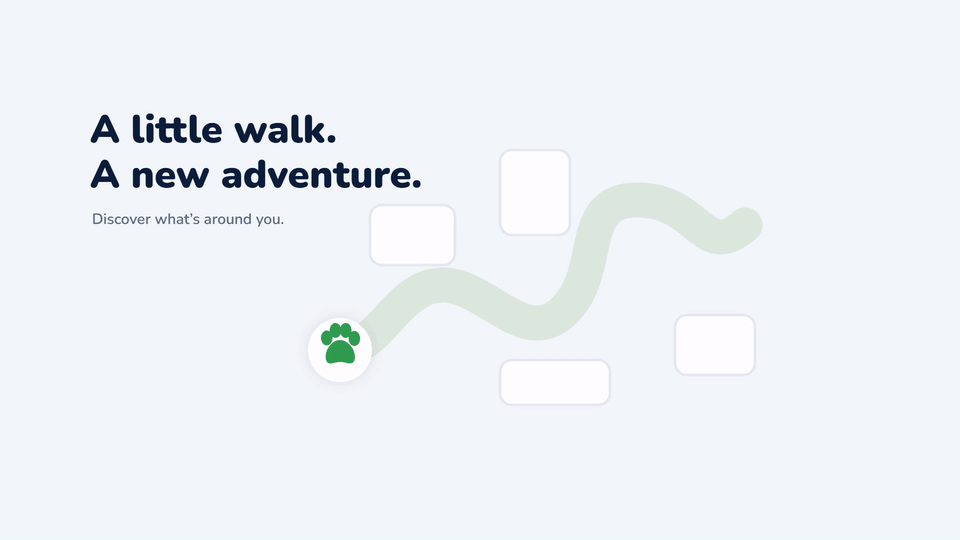
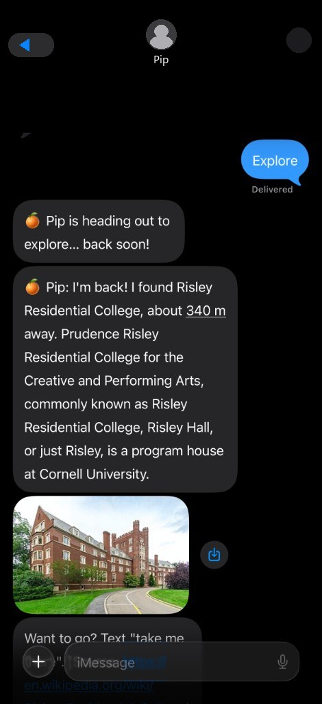
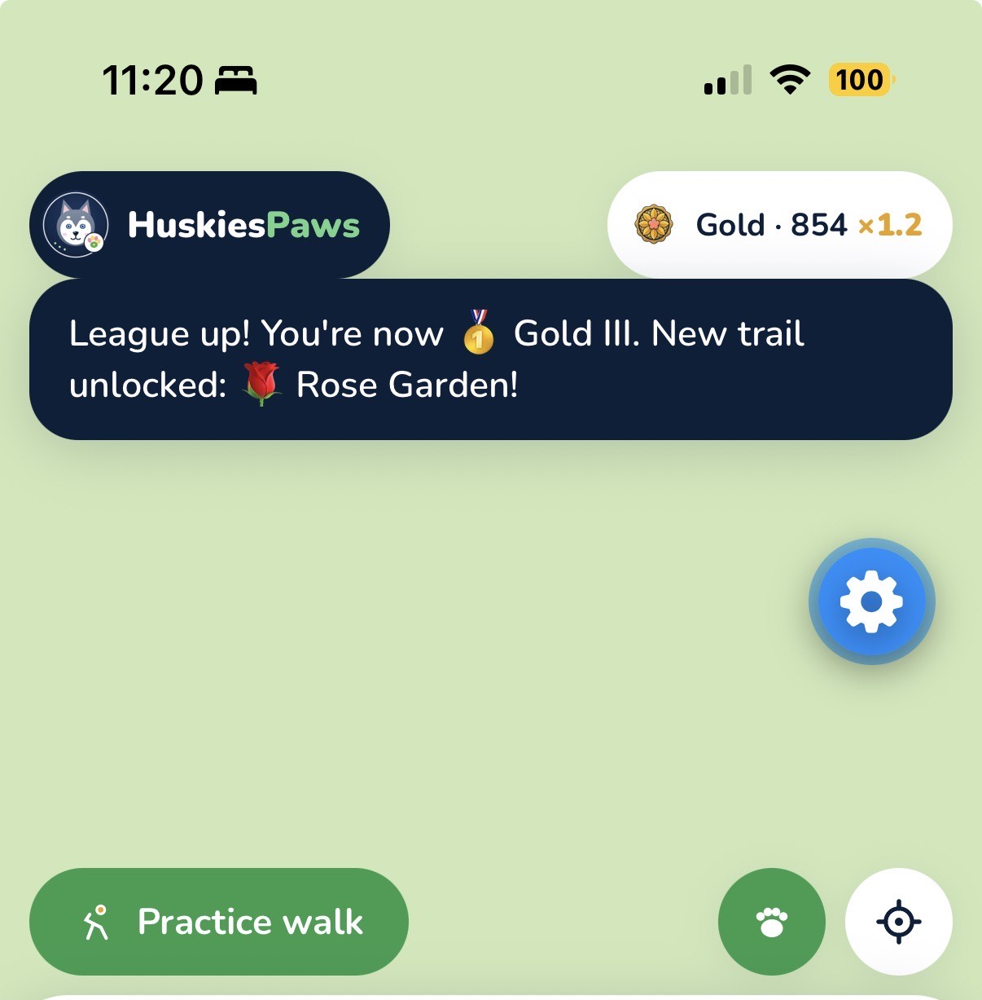
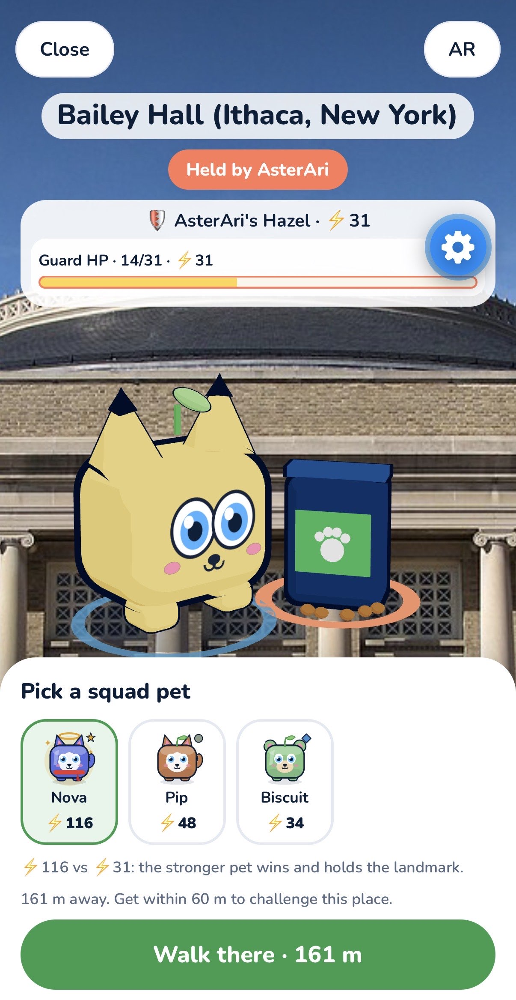
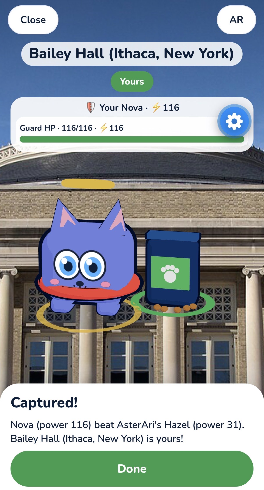
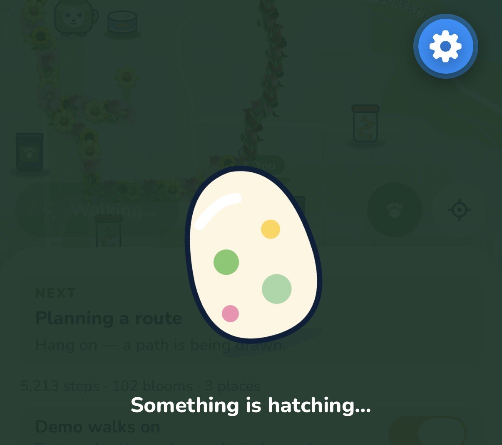
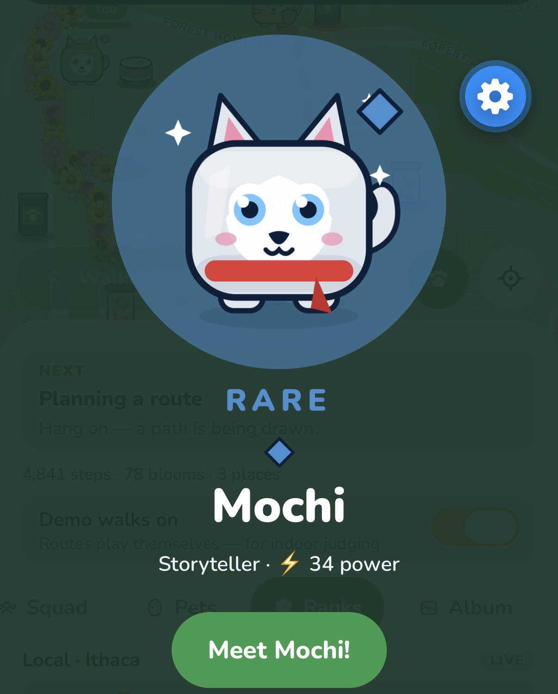
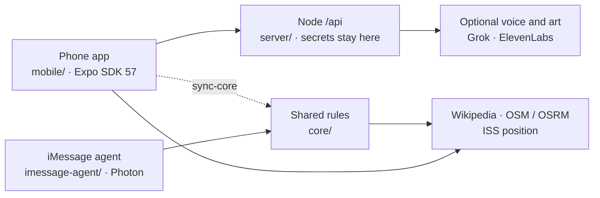

<p align="center">
  <picture>
    <source media="(prefers-color-scheme: dark)" srcset="docs/logo/huskiespaws-logo-dark.png">
    
  </picture>
</p>

<h1 align="center">HuskiesPaws</h1>

<p align="center"><strong>Turn everyday walks into a creature-collecting adventure.</strong></p>

<p align="center">
  An Expo phone app for <a href="https://bigredhacks2026.devpost.com/">BigRed//Hacks 2026</a> · theme <strong>Navigation</strong><br>
  <a href="https://github.com/LuisMend12/big-red-hacks2026">Code</a>
  ·
  <a href="docs/presentation/HuskiesPaws-BigRedHacks-2026.pdf">Pitch deck (PDF)</a>
  ·
  <a href="docs/presentation/HuskiesPaws-BigRedHacks-2026.pptx">Pitch deck (PPTX)</a>
</p>

HuskiesPaws is about **where you go**, not only how fast you arrive. Ordinary maps optimize for the pin. This app gives you a reason to look around: a role-based squad scouts real nearby places, walks you there on a blooming trail, and rewards the walk with creatures and landmark postcards.

<p align="center">
  
</p>

<p align="center"><em>Promo loop of the walk-and-bloom idea (960×540). It is brand motion, not a screen recording of the app.</em></p>

---

## The problem

Navigation today is built for the shortest path. That is useful, and it is incomplete.

- **The walk is leftover time.** Once the pin is set, people put the phone away.
- **Campus already has stories.** Named buildings sit a few minutes off the usual route and go unseen.
- **Step counters log numbers.** They rarely give a reason to walk *somewhere new*.

Walking already happens between classes. Discovery and progress do not.

## The loop: Explore → Walk → Discover → Collect

| Step | What you do | What the app does |
|---|---|---|
| **Explore** | Squad → Scout → Explore | Pip looks up real nearby places (Wikipedia geosearch). |
| **Walk** | Start the walk (Demo Walk indoors, or Walk live outdoors) | Fern requests a walking route. Flowers bloom along the path. |
| **Discover** | Read the postcard | Moss tells the story from the Wikipedia extract. Every postcard can link to its source. |
| **Collect** | Capture at the place; keep walking | Album postcard. Walking fills eggs; hatching adds a pet. Stronger pets can hold a landmark. |

Indoor judging uses **Demo walks**: routes play themselves along real geometry so nobody has to leave the table.

## The squad

Pip, Moss, and Fern are **role-based agents** in shared game logic (`core/`). They are not autonomous LLM teammates. Each role calls tools, then speaks only from those results: **place facts from Wikipedia**, **routes from a walking router** (OSRM / OpenStreetMap). If a tool returns nothing, the memo does not invent a landmark.

<p align="center">
  
  &nbsp;&nbsp;&nbsp;
  
  &nbsp;&nbsp;&nbsp;
  
</p>

| Agent | Class | Job |
|---|---|---|
| **Pip** | Scout | Finds a nearby place you have not visited yet. |
| **Moss** | Storyteller | Reads the grounded history of a place. |
| **Fern** | Pathfinder | Turns that place into a walking route and cheers when you arrive. |

Hatched pets can fill those classes (and a Guardian class for holding turf). The same rules drive the phone app and the optional Photon iMessage agent.

<p align="center">
  
</p>

<p align="center"><em>Same Explore loop over iMessage: text <code>Explore</code>, Pip scouts a real nearby place, then <code>take me there</code> starts the walk.</em></p>

## The app

Real Expo Go captures (not stock UI):

<p align="center">
  
  &nbsp;
  
  &nbsp;
  
</p>

<p align="center">
  
  &nbsp;
  
</p>

**Also built:** blooming trails by rank, eggs from walking only, rarity (including a 3× rare-hatch boost while the ISS is overhead, using live orbital data), turf with a hold cap and power check, local / statewide / national boards (live through the API, sample data without it), camera or drawn postcards for indoor capture.

## How we built it



The phone talks to `/api` only through `mobile/src/api.js`. Keys never ship in the app bundle. Image prompts are server templates, not free-form client text.

| Layer | Stack |
|---|---|
| Phone | Expo SDK 57, React Native, Nunito, `react-native-maps` (Expo Go). iOS **development build** can use MapLibre + OpenFreeMap. |
| Game rules | Plain JS in [`core/`](core/) (agents, ranks, pets, geo, ISS). Copied into `mobile/src/core/` with `npm run sync-core`. |
| API | Node, no runtime deps. File storage by default; Supabase schema is written but untested in production. |
| Speech | Stories can use **ElevenLabs** (Moss) or **Grok Voice** (Pip / Fern) when keys and credits exist. Everything else, and any failure, uses **on-device `expo-speech`**. |
| Images | **Grok Imagine** for postcards and hatch portraits when the key and credits exist. Otherwise original SVG art. |
| Space | Live ISS position / footprint from wheretheiss.at for hatch rarity. |
| Chat | Photon Spectrum iMessage agent (sessions in memory). |

**Grok and ElevenLabs are wired in `server/` and covered by tests against fakes.** Live speech and Imagine need `XAI_API_KEY` / `ELEVENLABS_API_KEY` **and account credits**. If credits are exhausted, the phone keeps playing with on-device voice and drawn art.

[`render.yaml`](render.yaml) is a Render blueprint. **We do not claim a live cloud deploy** unless `/api/health` is actually up.

## Built with Cursor

The SpaceX track asks for a project **built in Cursor**. This repo was iterated in Cursor Agent mode with [`.cursor/rules/`](.cursor/rules/) and a prompt log in [`CURSOR_LOG.md`](CURSOR_LOG.md). Highlights that landed in code:

- Walk loop UX: Next coach, Demo vs live walking, capture when you arrive, hatch-ready eggs.
- Original mascot, tab icons, and collectible pet art (not copied franchise assets).
- Cloudflare `npm run tunnel` so Expo Go works on guest Wi-Fi after Expo’s shared ngrok filled up.
- Voice and Imagine behind `/api`, with ElevenLabs for Moss stories and on-device fallback.
- ISS rare-hatch logic plus in-app cues.
- Judges deck generated from real Expo captures in [`docs/presentation/`](docs/presentation/).

## What works vs what is next

| Implemented | Fallback | Not this weekend |
|---|---|---|
| Explore → walk → capture loop on the phone | Demo walks indoors | Background GPS with the phone in a pocket |
| Wikipedia facts, OSM / OSRM routes | On-device speech, SVG art | A Render host that stays awake all event |
| Eggs, pets, turf rules, ISS rarity boost | Sample leaderboards / turf without `/api` | Richer social gardens and friend meetings |
| Photon iMessage in the terminal / with keys | — | Persistent iMessage sessions |
| iOS garden map in a **dev build** | Apple Maps in Expo Go | True world-locked AR |

Nessie / bank savings were **dropped**. Eggs are earned by walking, not purchased.

## Run it

**Node.js 22.9+** (server). Expo Go on a phone, SDK 57. Commands are from the folder named in the prompt. Paths with spaces need quotes.

### Keys (optional, never commit)

Root [`.env`](server/.env.example) (git-ignored):

```ini
XAI_API_KEY=
ELEVENLABS_API_KEY=
# optional
SUPABASE_URL=
SUPABASE_SERVICE_KEY=
```

Photon keys live only in `imessage-agent/.env` (see that folder’s example). Do not put Grok or ElevenLabs keys in the app.

### Server

```bash
cd server
npm start
```

Open http://localhost:8765/api/health. No `npm install`. Startup prints whether Grok and voice are on.

### Phone

```bash
cd mobile
npm install
npm run tunnel
```

Wait until the terminal says **Metro is up**, then scan **this run’s** QR (Camera on iPhone, Expo Go on Android). Guest Wi-Fi blocks LAN; the tunnel is required there. On a trusted home network, `npx expo start --go` is faster.

Point `EXPO_PUBLIC_API_URL` at the server if you want live voice, Imagine, turf, and boards. `npm run tunnel` will tunnel a local API on port 8765 when that server is already running. Details: [mobile/README.md](mobile/README.md).

### iMessage (optional)

```bash
cd imessage-agent
npm install
npm run terminal
```

Type `hi`, `explore`, `take me there`. Photon keys are only needed for real iMessage (`npm start`). Guide: [imessage-agent/README.md](imessage-agent/README.md). A live Explore thread is in the squad section above.

### Tests

```bash
cd core && npm test
cd ../server && npm test
cd ../imessage-agent && npm test
cd ../mobile && npm test && npx expo lint
```

After changing `core/`, run `npm run sync-core` in `mobile/` and commit the generated `mobile/src/core/` copy.

## Team

| Name | |
|---|---|
| **Luis Mendez** | Software engineer |
| **Abdullah Rashid** | Software engineer |

Built at Cornell, October 2–4, 2026.

## License

There is no project-wide license file in the repo root. `mobile/LICENSE` is Expo’s MIT license for Expo’s own files, not a grant for the whole hackathon project.

## Repository map

| Path | What |
|---|---|
| [`mobile/`](mobile/) | The product: Expo phone app |
| [`core/`](core/) | Shared game logic |
| [`server/`](server/) | `/api` for Grok, ElevenLabs, boards, turf |
| [`imessage-agent/`](imessage-agent/) | Photon Spectrum agent |
| [`docs/presentation/`](docs/presentation/) | Judges deck |
| [`docs/demo-gif/`](docs/demo-gif/) | Promo GIF / MP4 |
| [`CURSOR_LOG.md`](CURSOR_LOG.md) | Cursor prompt log |
| [`PLAN.md`](PLAN.md) | Weekend scope |
| [`docs/DEMO.md`](docs/DEMO.md) | Table-demo script |
